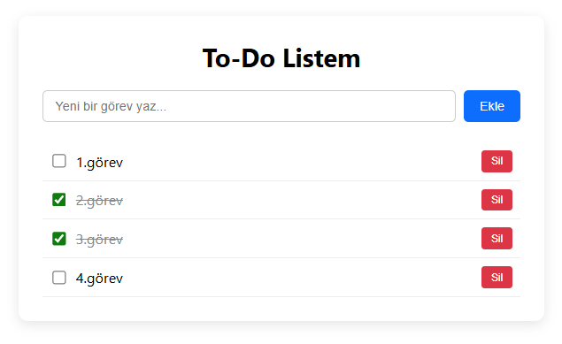

## Yapılabilecek Geliştirmeler

### API ve Backend Mimarisi (.NET 8)

* Authentication ve Authorization: JWT tabanlı authentication, RBAC (Role-Based Access Control) ve refresh token mekanizmaları.
* API Security: Rate limiting, sıkı CORS politikaları ve yaygın web zafiyetlerine karşı koruma entegrasyonu.
* Advanced Data Querying: Büyük veri setlerini verimli işleyebilmek için pagination, filtering ve sorting.
* Robust Validation: FluentValidation gibi kütüphaneler kullanılarak merkezi request validation altyapısının kurulması.
* Error Handling ve Logging: Global exception handling middleware'i ve structured logging entegrasyonu (örn. Serilog).
* Performance Optimization: Sık erişilen veri elemanları için in-memory veya distributed caching (örn. Redis).
* Real-time Communication: Veri state'i değiştiğinde client'lara anlık güncellemeler göndermek için SignalR entegrasyonu.
* Background Processing: Geciken görev uyarıları veya günlük özetler için zamanlanmış background worker/job mekanizmaları (örn. Quartz.NET, BackgroundWorker).
* API Versioning ve Health Checks: API endpoint'lerinin izlenmesi ve versioning standartlarının oturtturulması.

### Frontend Mimarisi ve Kullanıcı Arayüzü

* State Management: Öngörülebilir veri akışı için modern state management çözümlerinin (örn. Angular Signals, NgRx) kullanılması.
* Advanced Routing: Yetki gerektiren sayfalar için lazy-loading modülleri ve güçlü route guard mekanizmaları.
* HTTP Interceptor Kullanımı: Authorization header'larının eklenmesi, merkezi hata raporlama ve loading state'leri için API request'lerinin tek elden yönetimi.
* Real-time Data Sync: State değişikliklerini UI'a anında yansıtmak için SignalR event'lerinin Angular tarafında işlenmesi.
* Interactive UI Components: Görev önceliklendirme veya Kanban board görünümleri için drag-and-drop destekli arayüzler geliştirilmesi.
* Progressive Web App (PWA): Offline erişim, local data caching ve service worker entegrasyonu.

### Uygulama İşlevsel Özellikleri

* Task Organization: Projeler kurgulama, custom tag'ler ve çok seviyeli subtask'ler.
* Collaboration: Görev listelerini başka kullanıcılarla paylaşma, görevleri assign etme ve göreve özel comment thread'ler oluşturma.
* Audit Trails: Uygulama güvenilirliğini artırmak için görevde yapılan işlemlerin (creation, updates, status değişiklikleri vb.) history log olarak izlenmesi.
* File Attachments: Görevlere ilgili belgeleri veya referans görsellerini eklemek için güvenli file upload işlevselliği.
* Advanced Filtering: "Bugün Bitenler", "Gecikenler" veya kişiye özel filtering ekranları ve kategorizasyon.
